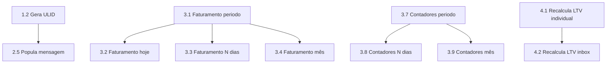

# 🗄️ Mini-Apps do Banco de Dados AGES

> Cada par função/gatilho funciona como um "mini-app" dentro do PostgreSQL. Clique no nome para ver o código completo e documentação.

---

## 📊 Visão Geral

| Categoria | Quantidade | Status |
|-----------|:----------:|:------:|
| [0* Gateway](#0---gateway-ponto-de-entrada) | 1 | 🟢 |
| [1* Infraestrutura](#1---infraestrutura-do-banco) | 2 | 🟢 |
| [2* Automações](#2---automações-de-gatilhos) | 9 | 🟢 |
| [3* Consultas](#3---funções-de-consultarelatório) | 10 | 🟢 |
| [4* Administrativas](#4---funções-administrativas) | 2 | 🟢 |
| **TOTAL** | **24** | |

**Funções:** 25 | **Gatilhos:** 20 | **Última atualização:** 2025-11-16

---

## 0* - GATEWAY (Ponto de Entrada)

> ⚠️ **CRÍTICO:** Porta de entrada de dados. Se falhar, todo o sistema para.

| ID | Mini-App | Tipo | Tabelas Afetadas |
|----|----------|------|------------------|
| 0.1 | [Cria ou atualiza inbox e contato via webhook](./0.1_Cria_ou_atualiza_inbox_e_contato_via_webhook/) | FN | `0a_inbox_whatsapp`, `1a_whatsapp_user_contact` |

---

## 1* - INFRAESTRUTURA DO BANCO

> Base do sistema. Funcionalidades que suportam todas as outras.

| ID | Mini-App | Tipo | Tabelas Afetadas |
|----|----------|------|------------------|
| 1.1 | [Atualiza timestamp automaticamente](./1.1_Atualiza_timestamp_automaticamente/) | FN + TR | Todas com `updated_at` (10+) |
| 1.2 | [Gera ULID para mensagens](./1.2_Gera_ULID_para_mensagens/) | FN | Nenhuma (utilitário) |

---

## 2* - AUTOMAÇÕES DE GATILHOS

> Executam automaticamente quando eventos ocorrem nas tabelas.

| ID | Mini-App | Tipo | Tabela Monitorada |
|----|----------|------|-------------------|
| 2.1 | [Sincroniza owner para celular](./2.1_Sincroniza_owner_para_celular/) | FN + TR | `3a_customer_root_record` |
| 2.2 | [Gera ID amigavel cliente](./2.2_Gera_ID_amigavel_cliente/) | FN + TR | `3a_customer_root_record` |
| 2.3 | [Gera ID amigavel atendimento](./2.3_Gera_ID_amigavel_atendimento/) | FN + TR | `4a_customer_service_history` |
| 2.4 | [Marca primeiro registro como principal](./2.4_Marca_primeiro_registro_como_principal/) | FN + 3 TR | `3b`, `3e`, `3f` |
| 2.5 | [Popula campos mensagem automaticamente](./2.5_Popula_campos_mensagem_automaticamente/) | FN + TR | `2b_conversation_messages` |
| 2.6 | [Valida completude formulario](./2.6_Valida_completude_formulario/) | 2 FN + 9 TR | `3a` a `3i` (9 tabelas) |
| 2.7 | [Define timestamp por status](./2.7_Define_timestamp_por_status/) | FN + TR | `4a_customer_service_history` |
| 2.8 | [Atualiza contador status atendimento](./2.8_Atualiza_contador_status_atendimento/) | FN + TR | `4a_customer_service_history` |
| 2.9 | [Atualiza LTV cliente automaticamente](./2.9_Atualiza_LTV_cliente_automaticamente/) | FN + TR | `4a_customer_service_history` |

---

## 3* - FUNÇÕES DE CONSULTA/RELATÓRIO

> Chamadas pela aplicação para buscar e agregar dados.

| ID | Mini-App | Retorno | Uso Principal |
|----|----------|---------|---------------|
| 3.1 | [Busca faturamento por periodo](./3.1_Busca_faturamento_por_periodo/) | JSONB | Relatórios customizados |
| 3.2 | [Busca faturamento hoje](./3.2_Busca_faturamento_hoje/) | JSONB | Dashboard diário |
| 3.3 | [Busca faturamento ultimos N dias](./3.3_Busca_faturamento_ultimos_N_dias/) | JSONB | Análise recente |
| 3.4 | [Busca faturamento mes especifico](./3.4_Busca_faturamento_mes_especifico/) | JSONB | Relatório mensal |
| 3.5 | [Busca LTV cliente](./3.5_Busca_LTV_cliente/) | JSONB | Perfil do cliente |
| 3.6 | [Lista top clientes por LTV](./3.6_Lista_top_clientes_por_LTV/) | TABLE | Ranking de clientes |
| 3.7 | [Busca contadores atendimento por periodo](./3.7_Busca_contadores_atendimento_por_periodo/) | JSONB | Analytics |
| 3.8 | [Busca contadores ultimos N dias](./3.8_Busca_contadores_ultimos_N_dias/) | JSONB | Dashboard recente |
| 3.9 | [Busca contadores mes especifico](./3.9_Busca_contadores_mes_especifico/) | JSONB | Relatório mensal |
| 3.10 | [Conta mudancas status](./3.10_Conta_mudancas_status/) | JSONB | Análise de fluxo |

---

## 4* - FUNÇÕES ADMINISTRATIVAS

> Executadas manualmente para manutenção e correção de dados.

| ID | Mini-App | Parâmetro | Quando Usar |
|----|----------|-----------|-------------|
| 4.1 | [Recalcula LTV cliente individual](./4.1_Recalcula_LTV_cliente_individual/) | `root_id` | Correção pontual |
| 4.2 | [Recalcula LTV todos clientes inbox](./4.2_Recalcula_LTV_todos_clientes_inbox/) | `inbox_id` | Migração/Auditoria |

---

## 🔗 Dependências Entre Mini-Apps



---

## 🚀 Fluxo de Execução

```
WEBHOOK → [0.1] Gateway
              ↓
         DADOS NO BD
              ↓
    ┌─────────────────────┐
    │  GATILHOS AUTO (2*) │
    │  • IDs gerados      │
    │  • Timestamps       │
    │  • Contadores       │
    │  • LTV atualizado   │
    └─────────────────────┘
              ↓
         DADOS PRONTOS
              ↓
    ┌─────────────────────┐
    │   CONSULTAS (3*)    │
    │  • Faturamento      │
    │  • Métricas LTV     │
    │  • Contadores       │
    └─────────────────────┘
              ↓
    ┌─────────────────────┐
    │  MANUTENÇÃO (4*)    │
    │  (quando necessário)│
    └─────────────────────┘
```

---

## ➕ Adicionar Novo Mini-App

1. **Identifique a categoria** (0* a 4*)
2. **Pegue o próximo número** (ex: 2.10, 3.11)
3. **Crie a pasta:** `X.Y Nome do mini app`
4. **Adicione os arquivos:**
   - `FN_nome_funcao.sql`
   - `TR_nome_trigger.sql` (se aplicável)
   - `README.md`
5. **Atualize esta página** adicionando o link na tabela

📖 [Template completo e instruções detalhadas](./MINI_APPS_DATABASE_CATALOG.md#como-adicionar-novo-mini-app)

---

## 📚 Documentação Relacionada

- [Catálogo Completo (detalhes técnicos)](./MINI_APPS_DATABASE_CATALOG.md)
- [Funções e Triggers - Referência](./FUNCTIONS_AND_TRIGGERS_REFERENCE.txt)
- [Mapa de Relacionamentos](./TRIGGER_FUNCTION_RELATIONSHIPS.txt)
- [Schema do Banco](./schema.sql)

---

## 🏷️ Legenda

| Símbolo | Significado |
|---------|-------------|
| FN | Apenas função (sem gatilho) |
| FN + TR | Função com gatilho associado |
| FN + N TR | Função com múltiplos gatilhos |
| N FN + N TR | Múltiplas funções e gatilhos |
| 🟢 | Implementado e funcionando |
| 🟡 | Em desenvolvimento |
| 🔴 | Precisa de revisão |

---

<div align="center">

**AGES Database Mini-Apps**

Versão 1.0 | 24 Mini-Apps | 25 Funções | 20 Gatilhos

</div>
